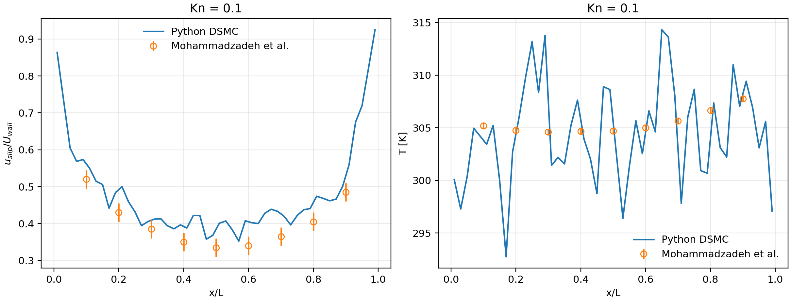

# DSMC Lid-Driven Cavity: Validation-Ready CPU/GPU Solver

A reproducible Python teaching solver for the isothermal rarefied
lid-driven cavity. It supports CPU (NumPy) and optional NVIDIA GPU (CuPy)
execution and keeps the molecular model fixed while students change the
collision-pair selection algorithm.

The benchmark follows Mohammadzadeh *et al.*, *Physical Review E* **85**,
056310 (2012): monatomic argon, 300 K diffuse walls, a 100 m/s lid, and
`Kn = 0.005, 0.05, 0.1`.

## Collision algorithms

| CLI name | Pair-selection rule | Time-step note |
|---|---|---|
| `ntc` | Bird no-time-counter with a persistent cell majorant | Standard DSMC limits |
| `ntc-prescan` | NTC with a cell-local pre-scan before selection | Standard DSMC limits |
| `mfs` | Poisson majorant-frequency event count | Standard DSMC limits |
| `sbt` | Sequential Bernoulli trials | Enforces `W_max <= probability_target` |
| `gbt` | Reduced-trial generalized BT | Enforces the GBT probability bound |
| `ssbt` | Symmetric partner choice over the full cell | Enforces the SSBT probability bound |
| `sgbt` | Reduced symmetric generalized BT with duplicate-pair rejection | Enforces the SGBT probability bound |
| `sbt-tas` | SBT in adaptive, staggered subcells | Smaller TAS subcell-volume limit |
| `gbt-tas` | GBT in adaptive, staggered subcells | Smaller TAS subcell-volume limit |

Every method uses the same VHS cross section, diffuse-wall kernel, elastic
post-collision scattering, moment sampler, and output writer. `DCP` and
`DCP-VR` from an exploratory relaxation notebook are intentionally excluded:
they do not yet have the publication-level derivation and independent cavity
validation required for a textbook reference implementation.

## Install

```bash
cd validated_cavity_dsmc
python -m venv .venv
source .venv/bin/activate
python -m pip install -e .
```

For an NVIDIA CUDA 12 runtime:

```bash
python -m pip install -e '.[gpu-cuda12]'
dsmc-cavity --config configs/student_kn01.toml --backend gpu
```

`--backend auto` selects a usable CUDA device and otherwise uses the CPU.
The GPU path is not a separate solver: it executes the same trial list and
VHS kernel with CuPy arrays. Accepted collisions are edge-colored into
particle-disjoint rounds before vectorized scattering, preventing write races.

## First run

```bash
dsmc-cavity --config configs/quick_cpu.toml
python -m unittest discover -s tests -v
```

The quick case only checks software plumbing. A moderate student case is:

```bash
dsmc-cavity --config configs/student_kn01.toml
```

## Select a collision model

```bash
dsmc-cavity \
  --config configs/student_kn01.toml \
  --model sgbt \
  --backend auto \
  --output-dir results/student_kn01_sgbt
```

Compare all methods with identical macroscopic settings:

```bash
python scripts/compare_models.py --kn 0.1 --nx 24 --ppc 12 --steps 1500 --warmup 500
```

Here `steps` and `warmup` define the NTC-PreScan reference physical times.
The script automatically increases the number of BT-family steps when their
probability-limited `dt` is smaller, so every model is compared after the same
physical warmup and over the same physical duration.

Plot a completed field:

```bash
python scripts/plot_run.py results/student_kn01/fields.npz \
  --output results/student_kn01/overview.png
```

## Bernoulli-trial time step

Leaving `dt` unset is strongly recommended. The solver evaluates three limits:

1. molecular motion relative to the cell width;
2. mean collision time;
3. maximum Bernoulli-trial probability for SBT/GBT/SSBT/SGBT and TAS.

For a BT model the smallest limit is selected. If a user supplies a larger
`dt` under strict mode, the run stops before initialization. The collision
kernel also aborts if an observed trial probability exceeds unity. This is
deliberately stricter than clipping a probability, because clipping silently
changes the collision rate.

The selected value and all competing limits are saved in `metadata.json`.

## Mohammadzadeh validation

The publication-level starting files are in `configs/production_*`. They use
the reported 200x200 grid and 32 initial particles per cell. These cases are
large and should be run on a GPU or cluster, with at least three seeds.

After a run:

```bash
dsmc-cavity-validate \
  results/production_kn01_ntc_prescan/lid_profile.csv \
  --kn 0.1 \
  --output results/production_kn01_ntc_prescan/validation_metrics.json \
  --plot results/production_kn01_ntc_prescan/validation.png
```

The committed reference table contains a conservative digitization of the
macroscopic DSMC open-circle data in PRE Figs. 4 and 5. Validation is restricted
to `0.1 <= x/L <= 0.9`; the corner singularities are reported separately.
Default acceptance targets are:

- lid-slip RMSE no larger than 0.08;
- lid-temperature RMSE no larger than 2 K;
- zero probability exceedances;
- repeat-seed uncertainty reported for a book figure.

These are repository gates, not a replacement for a grid/PPC/time-step study.
The exact verification state, including the coarse CPU refinement results and
the still-pending 200x200 GPU matrix, is recorded in `VALIDATION_STATUS.md`.

The current 50x50, Kn=0.1 CPU baseline passes both interior-profile gates
(slip RMSE 0.0507 and temperature RMSE 1.757 K):



The displayed Python curve is raw and deliberately unsmoothed.  Its profile
CSV and JSON metrics are committed beside the figure.

For the Unity 2080 Ti queue, a non-interactive `mamba run` launch template is
provided in `hpc/unity_gpu_validation.slurm`.

## Output contract

Each run creates:

- `fields.npz`: 2-D arrays for density, velocity, temperature, stress, heat
  flux, vorticity, and sample count;
- `grid.csv`: flat AI-ready grid table;
- `lid_profile.csv`: macroscopic and incident-particle lid profiles;
- `history.csv`: convergence diagnostics;
- `metadata.json`: physical inputs, resolution ratios, seed, runtime,
  backend, and collision statistics.

No spatial smoothing is applied to the saved validation profiles.

## Validation hierarchy

1. Pair scattering conserves momentum and translational energy.
2. Every collision algorithm passes a cavity smoke run with no probability
   exceedance.
3. Collision models are compared against `ntc-prescan` with the same seed and
   numerical resolution.
4. NTC/NTC-PreScan are compared to the published lid profiles.
5. Production model equivalence is assessed using repeat seeds and confidence
   intervals, not a single noisy curve.

## Citation

```text
A. Mohammadzadeh, E. Roohi, H. Niazmand, S. Stefanov, and R. S. Myong,
Thermal and second-law analysis of a micro- or nanocavity using direct-
simulation Monte Carlo, Physical Review E 85, 056310 (2012).
https://doi.org/10.1103/PhysRevE.85.056310
```
